# Doubly Linked List

## Doubly Linked List Introduction

A **D**oubly **L**inked **L**ist (DLL) contains an extra pointer, typically called *previous pointer*, together with next pointer and data which are there in singly linked list.


```c++
class Node 
{ 
    public:
        int data; 
        Node* next; // Pointer to next node in DLL
        Node* prev; // Pointer to previous node in DLL
};
```

### Advantages over singly linked list

1) A DLL can be traversed in both forward and backward direction.
2) The delete operation in DLL is more efficient if pointer to the node to be deleted is given.
3) We can quickly insert a new node before a given node.

### Disadvantages over singly linked list

1) Every node of DLL Require extra space for an previous pointer.
2) All operations require an extra pointer previous to be maintained

## Insertion in doubly linked list

### Add a node at the front of the DLL

The new node is always added before the head of the given Linked List. And newly added node becomes the new head of DLL


```Algorithm
Five steps process:
1. allocate node
2. put in the data
3. Make next of new node as head
4. change prev of head node to new node
5. move the head to point to the new node
```

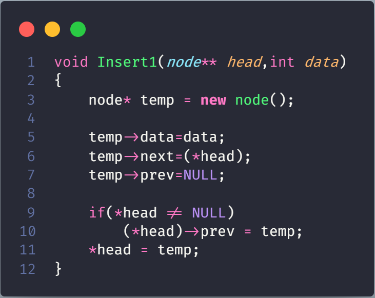

### Add a node after a given node

We are given pointer to a node as prev_node, and the new node is inserted after the given node.


```Algorithm
Seven steps process:
1. check if the given prev_node is NULL
2. allocate new node
3. put in the data
4. Make next of new node as next of prev_node
5. Make the next of prev_node as new_node
6. Make prev_node as previous of new_node
7. Change previous of new_node's next node
```

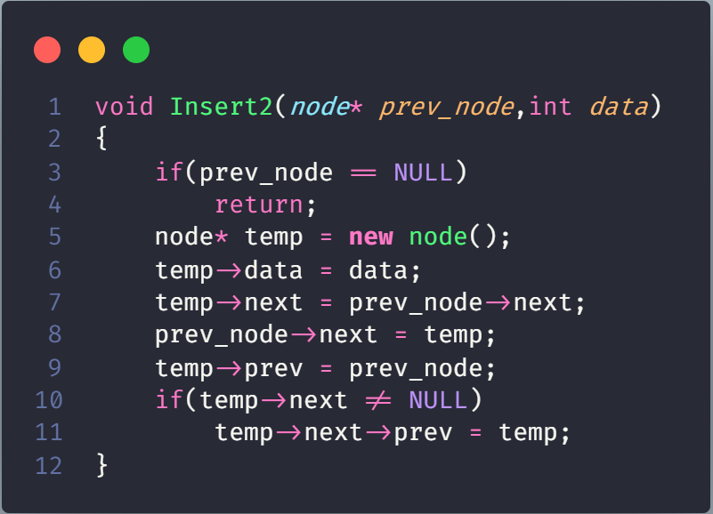

### Add a node at the end of the DLL

We are given pointer to a node as `prev_node`, and the new node is inserted after the given node


```Algorithm
Seven steps process:
1. allocate node
2. put in the data
3. This new node is going to be the last node, so make next of it as NULL
4. If the Linked List is empty, then make the new  node as head
5. Else traverse till the last node
6. Change the next of last node
7. Make last node as previous of new node
```

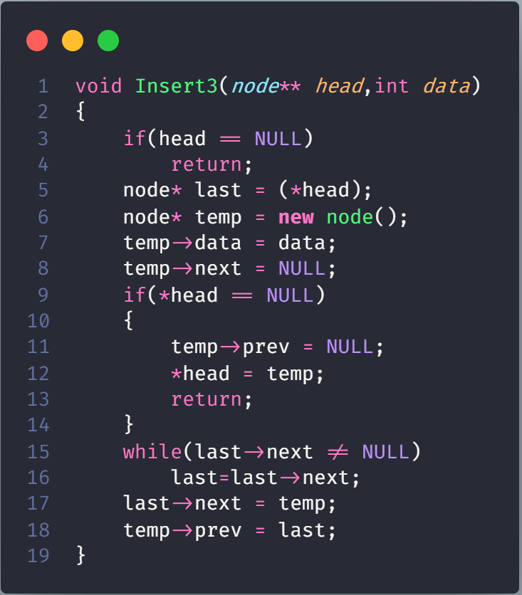

### Add a node before a given node

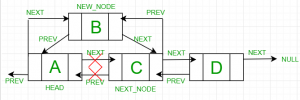

```Algorithm
Eight steps process:  
1. If next_node NULL, return from the function 
Because any new node can not be added before a NULL
2. Allocate node
3. Put in the data
4. Set the previous pointer of this new_node 
as the previous node of the next_node
5. Set the previous pointer of the next_node as the new_node
6. Set the next pointer of this new_node as the next_node
7. If the previous node of the new_node is not NULL, 
Then set the next pointer of this previous node as new_node
8. Else, if the prev of new_node is NULL, 
It will be the new head node.
```

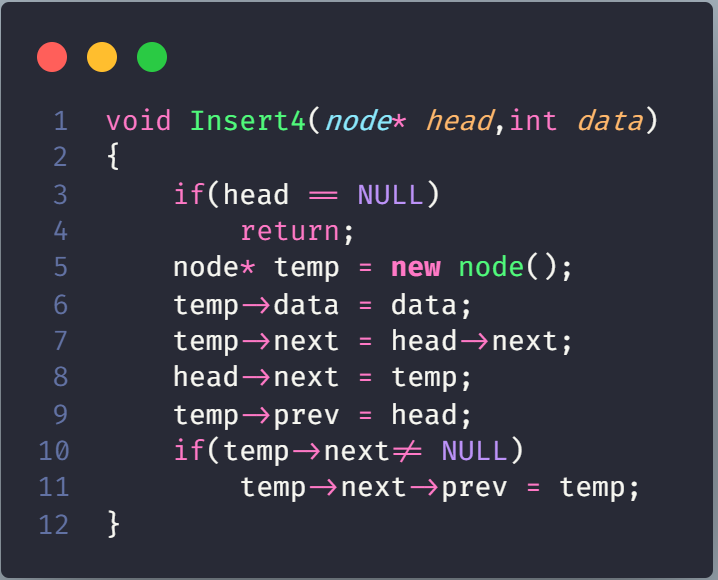

## Delete a node in a Doubly Linked List

**Approach**: The deletion of a node in a doubly-linked list can be divided into three main categories

- After the deletion of the head node

    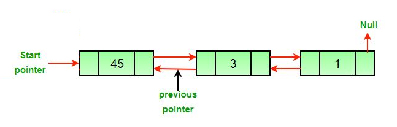

- After the deletion of the middle node

    

- After the deletion of the last node

    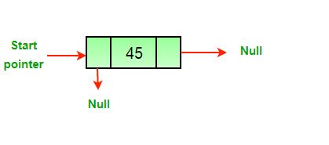

**All three mentioned cases can be handled in two steps if the pointer of the node to be deleted and the head pointer is known.**

1) If the node to be deleted is the head node then make the next node as head.
2) If a node is deleted, connect the next and previous node of the deleted node


**Algorithm**
Let the node to be deleted be *del*
If node to be deleted is head node, then change the head pointer to next current head

```c++
if headnode == del then
      headnode =  del.nextNode
```

Set *next* of previous to *del*, if previous to *del* exists

```c++
if del.nextNode != none 
    del.nextNode.previousNode = del.previousNode
```

Set *prev* of next to *del*, if next to *del* exists.

```c++
if del.previousNode != none 
    del.previousNode.nextNode = del.next
```

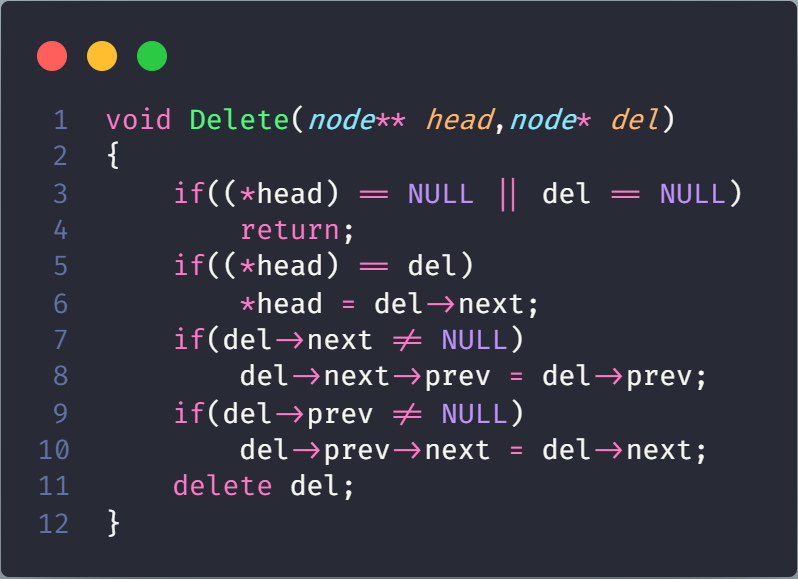

### Reverse a Doubly Linked List

#### Method 1 Reverse a DLL

We need to do is swap prev and next pointers for all nodes, change prev of the head (or start) and change the head pointer in the end.

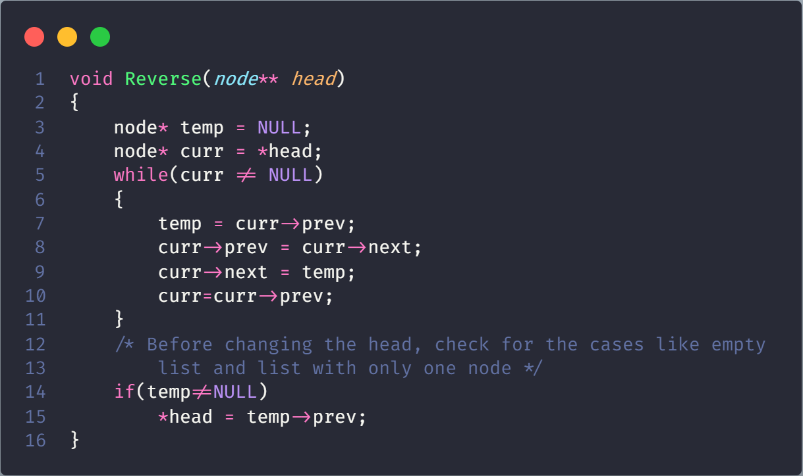

_**Time Complexity**_: `O(N)` `where N denotes the number of nodes in the doubly linked list`.
_**Auxiliary Space**_: `O(1)`

#### Method 2 Reverse a DLL

```json
Steps:
1. Keep pushing the node’s data in the stack. -> O(n)
2. The keep popping the elements out 
and updating the Doubly Linked List
```

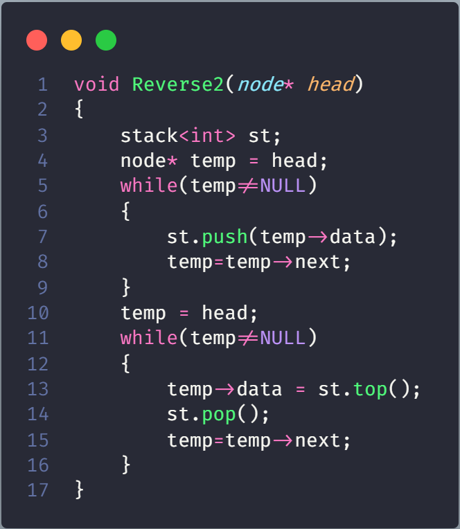

_**Time Complexity**_: `O(N)`
_**Auxiliary Space**_: `O(N)`

In this method, we traverse the linked list once and add elements to the stack, and again traverse the whole for updating all the elements. The whole takes 2n time, which is the time complexity of O(n).

### QuickSort on Doubly Linked List

The idea is simple, we first find out pointer to the last node. Once we have a pointer to the last node, we can recursively sort the linked list using pointers to first and last nodes of a linked list, similar to the above recursive function where we pass indexes of first and last array elements. The partition function for a linked list is also similar to partition for arrays. Instead of returning index of the pivot element, it returns a pointer to the pivot element. In the following implementation, quickSort() is just a wrapper function, the main recursive function is _quickSort() which is similar to quickSort() for array implementation.

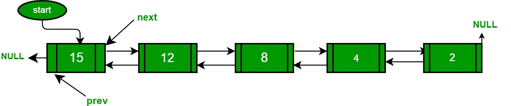

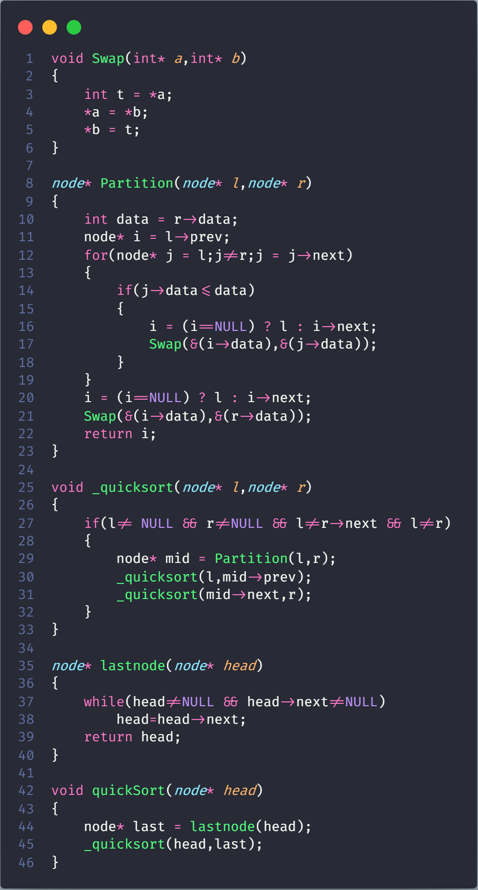

**Time Complexity**: Time complexity of the above implementation is same as time complexity of QuickSort() for arrays. It takes O(n^2^) time in the worst case and O(NLogN) in average and best cases. The worst case occurs when the linked list is already sorted.

### Find pairs with given sum in doubly linked list

Given a sorted doubly linked list of positive distinct elements, the task is to find pairs in a doubly-linked list whose sum is equal to given value x, without using any extra space?

**Example:**

```Example
Input : 1 <-> 2 <-> 4 <-> 5 <-> 6 <-> 8 <-> 9
        x = 7
Output: (6, 1), (5,2)    
```

The expected time complexity is O(n) and auxiliary space is O(1).

A **simple approach** for this problem is to one by one pick each node and find a second element whose sum is equal to x in the remaining list by traversing in the forward direction. The time complexity for this problem will be O(n^2^), n is the total number of nodes in the doubly linked list.

An **efficient solution**. Here is the algorithm :

- Initialize two pointer variables to find the candidate elements in the sorted doubly linked list. Initialize **first** with the start of the doubly linked list i.e; **first=head** and initialize **second** with the last node of the doubly linked list i.e; **second=last_node**.
- We initialize **first** and **second** pointers as first and last nodes. Here we don’t have random access, so to find the second pointer, we traverse the list to initialize the second.
- If current sum of **first** and **second** is less than x, then we move **first** in forward direction. If current sum of **first** and **second** element is greater than x, then we move **second** in backward direction.
- Loop termination conditions are also different from arrays. The loop terminates when two pointers cross each other (second->next = first), or they become the same (first == second).
- The case when no pairs are present will be handled by the condition “first==second”

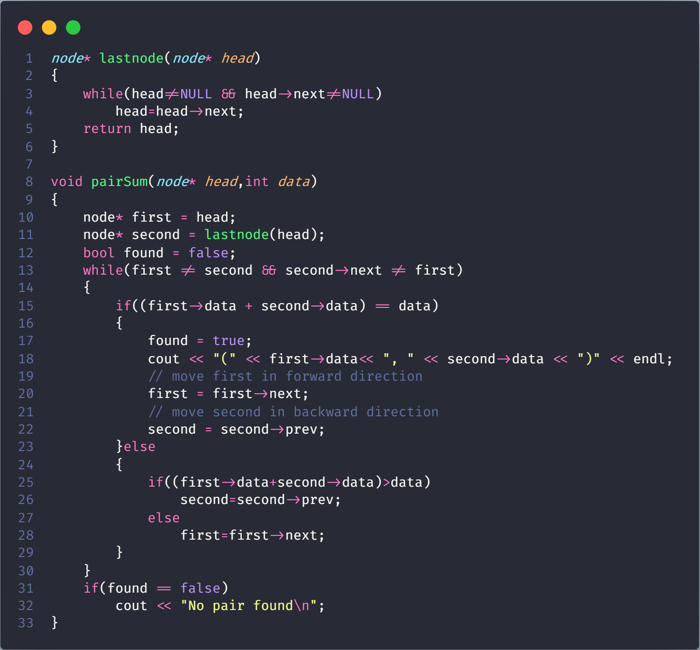

**Time complexity** : `O(N)`
**Auxiliary space** : `O(1)`

If linked list is not sorted, then we can sort the list as a first step. But in that case overall time complexity would become `O(NLogN)`

### Insert value in sorted way in a sorted doubly linked list

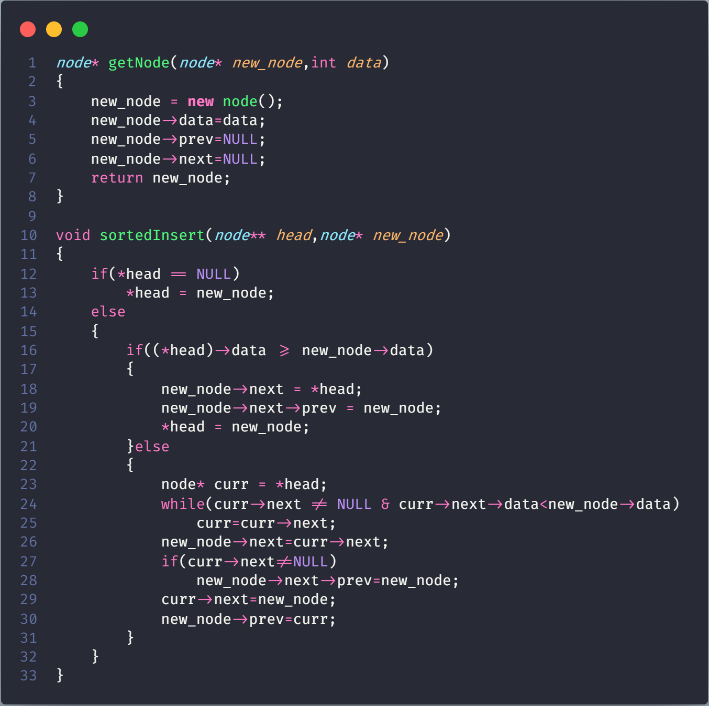

**Time Complexity**: O(N)

### Merge Sort for Doubly Linked List

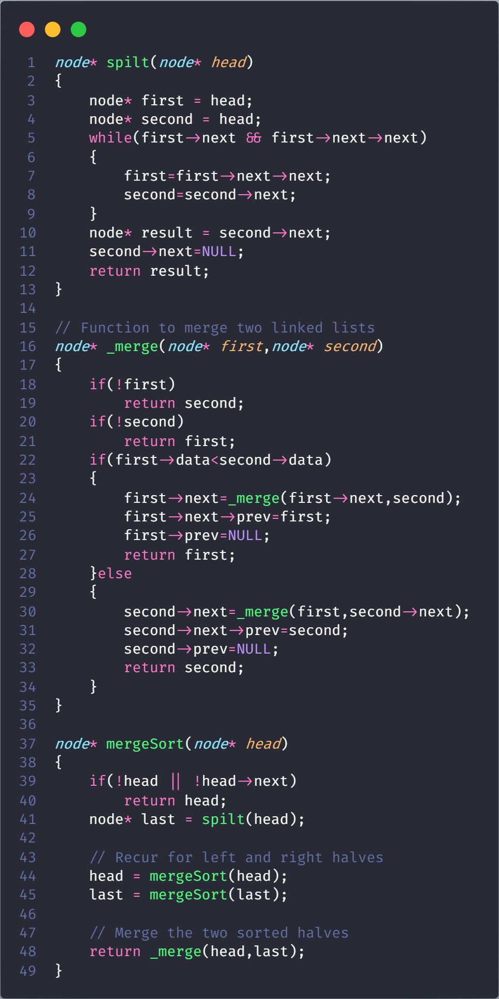

### Delete a Doubly Linked List node at a given position

**Approach**: Following are the steps:

- Get the pointer to the node at position n by traversing the doubly linked list up to the nth node from the beginning.
- Delete the node using the pointe

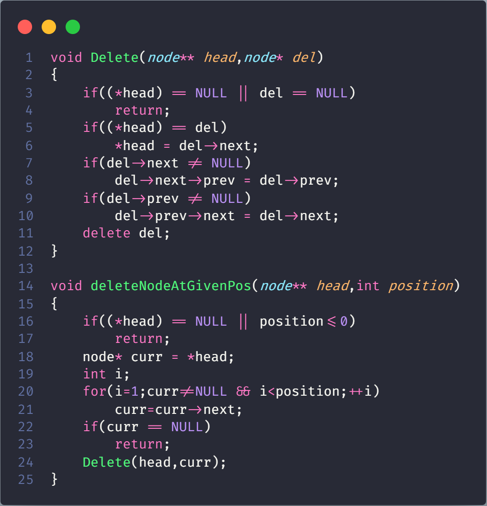

**Time Complexity**: `O(n)`, in the worst case where n is the number of nodes in the doubly linked list.

### Count triplets in a sorted doubly linked list whose sum is equal to a given value x

**Method 1 (Naive Approach)**: Using three nested loops generate all triplets and check whether elements in the triplet sum up to **x** or not.

**Time Complexity**: O(n^3^)
**Auxiliary Space**: O(1)

**Method 2 (Hashing)**: Create a hash table with **(key, value)** tuples represented as **(node data, node pointer) tuples**. Traverse the doubly linked list and store each node’s data and its pointer pair(tuple) in the hash table. Now, generate each possible pair of nodes. For each pair of nodes, calculate the **p_sum**(sum of data in the two nodes) and check whether **(x-p_sum)** exists in the hash table or not. If it exists, then also verify that the two nodes in the pair are not same to the node associated with **(x-p_sum)** in the hash table and finally increment **count**. Return **(count / 3)** as each triplet is counted 3 times in the above process.

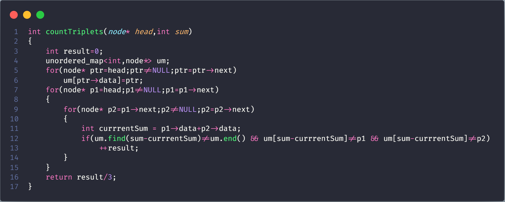

**Time Complexity**: O(n^2^)
**Auxiliary Space**: O(n)

**Method 3 Efficient Approach(Use of two pointers)**: Traverse the doubly linked list from left to right. For each **current** node during the traversal, initialize two pointers **first** = pointer to the node next to the **current** node and **last** = pointer to the last node of the list. Now, count pairs in the list from **first** to **last** pointer that sum up to value **(x – current node’s data)**. Add this count to the total_count of triplets. Pointer to the **last** node can be found only once in the beginning.

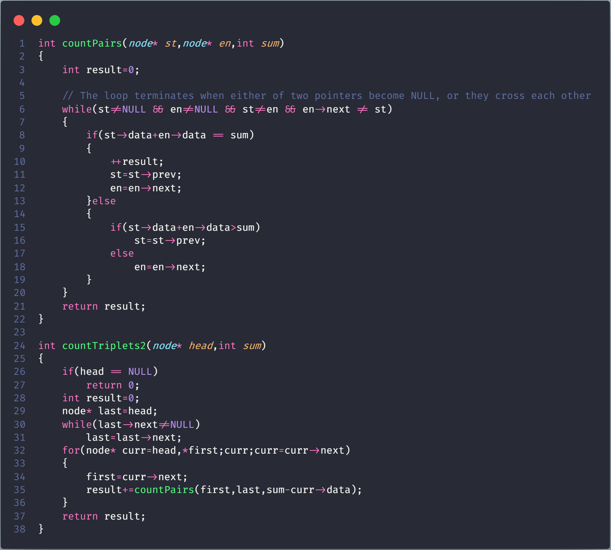

### Remove duplicates from a sorted doubly linked list {#RemoveDuplicates-sorted}

Given a sorted doubly linked list containing **n** nodes. The problem is removing duplicate nodes from the given list

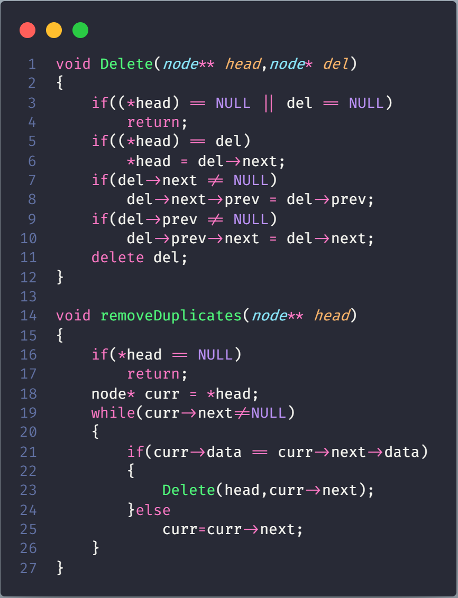

**Time Complexity**: O(n)

### Delete all occurrences of a given key in a doubly linked list

**Time Complexity**: O(n)

### Remove duplicates from an unsorted doubly linked list

Given an unsorted doubly linked list containing **n** nodes. The problem is to remove duplicate nodes from the given list.

**Method 1 (Naive Approach)**: This is the simplest way where two loops are used. The outer loop is used to pick the elements one by one and the inner loop compares the picked element with the rest of the elements.

**Time Complexity**: O(n^2^)
**Auxiliary Space**: O(1)

**Method 2 (Sorting)**: [Read here](#RemoveDuplicates-sorted)

**Method 3 Efficient Approach(Hashing)**: We traverse the doubly linked list from head to end. For every newly encountered element, we check whether it is in the hash table: if yes, we remove it; otherwise we put it in the hash table.

> Hash table is implemented using [unordered_set in C++](https://www.geeksforgeeks.org/unordered_set-in-cpp-stl/)

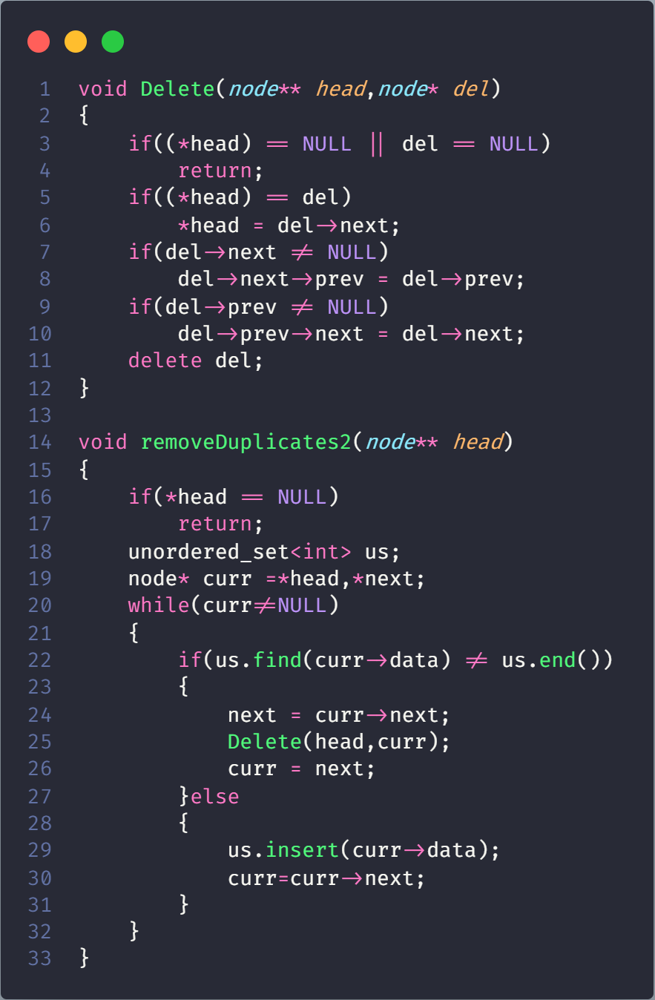

**Time Complexity**: O(n)
**Auxiliary Space**: O(n)

### Rotate Doubly linked list by N nodes

Given a doubly-linked list, rotate the linked list counter-clockwise by N nodes. Here N is a given positive integer and is smaller than the count of nodes in linked list.

```Example
Input : a  b  c  d  e   N = 2
Output : c  d  e  a  b 

Input : a  b  c  d  e  f  g  h   N = 4
Output : e  f  g  h  a  b  c  d 
```

Algorithms:

1) To rotate the Doubly linked list, first, we need to traverse through the linked list and find the address of the last node.
2) Then make it a circular linked list.
3) Then move the head as well as a temp by n nodes.
4) Then make the linked list as un-circular.

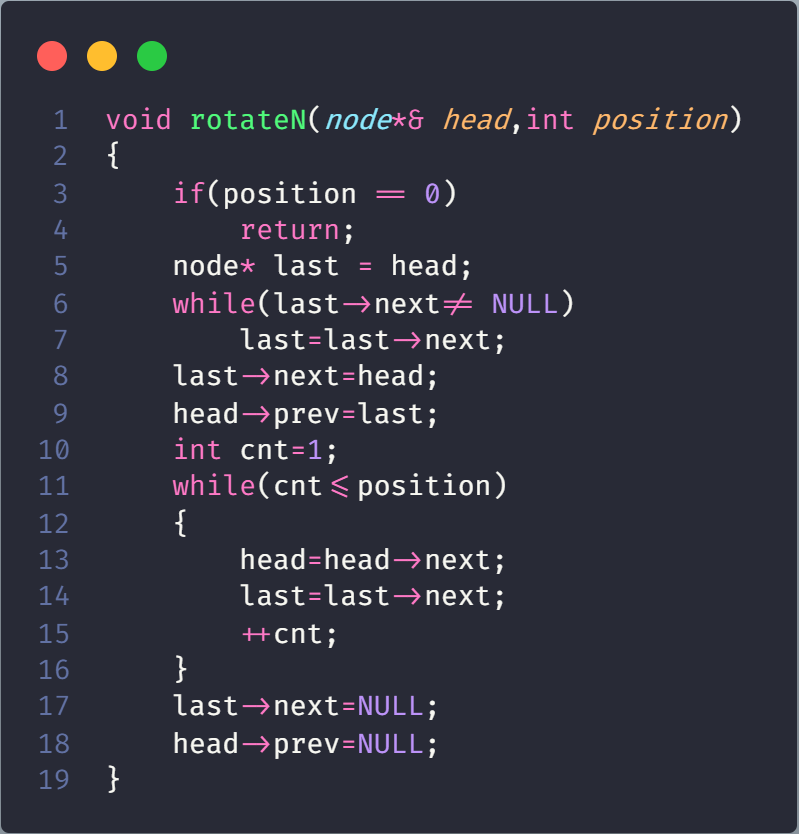

Time Complexity: O(N)
Space Complexity: O(1)

### Reverse a doubly linked list in groups of given size

Given a doubly linked list containing **n** nodes. The problem is to reverse every group of **k** nodes in the list

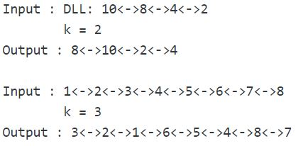

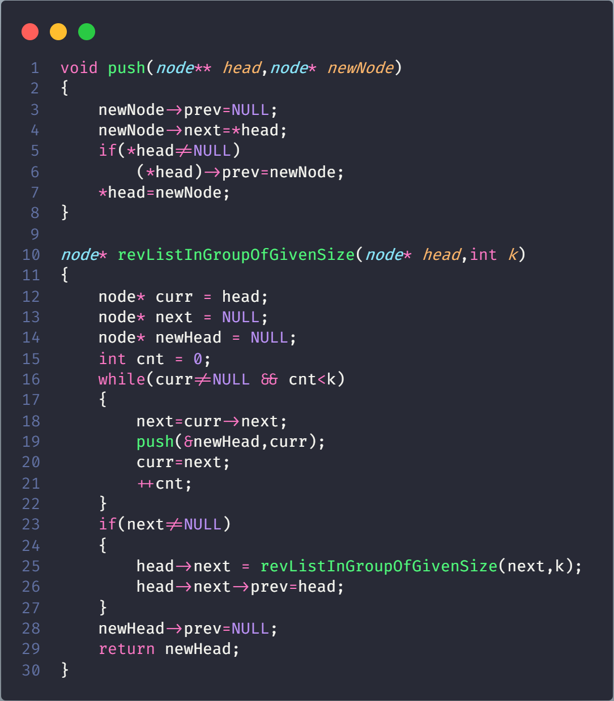

**Time Complexity**: O(n).
