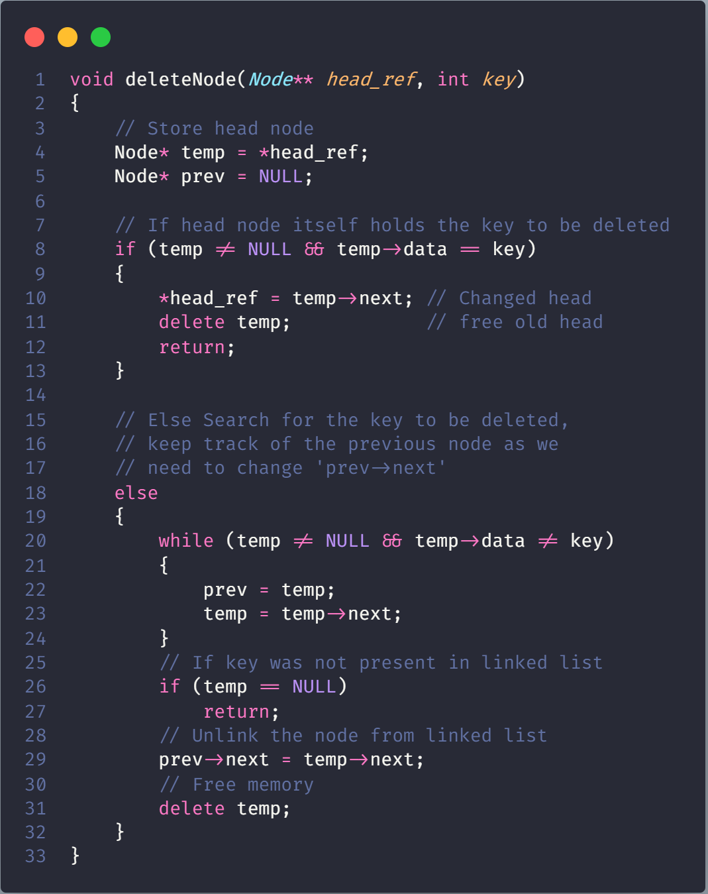
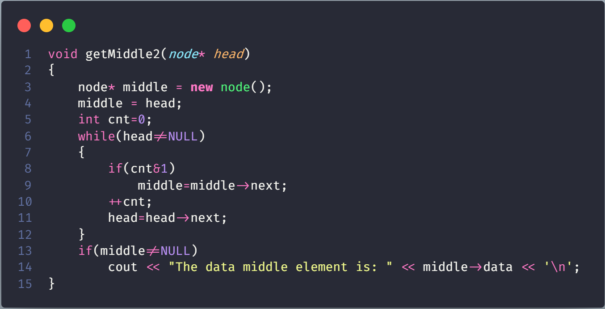

# Singly Linked List

Like arrays, Linked List is a linear data structure. Unlike arrays, linked list elements are not stored at a contiguous location; the elements are linked using pointers.


## Introduction

### Why Linked List?

Arrays can be used to store linear data of similar types, but arrays have the following limitations.

**1)** The size of the arrays is fixed: So we must know the upper limit on the number of elements in advance. Also, generally, the allocated memory is equal to the upper limit irrespective of the usage

**2)** Inserting a new element in an array of elements is expensive because the room has to be created for the new elements and to create room existing elements have to be shifted

> In a system, if we maintain a sorted list of IDs in an array id[]. id[] = [1000, 1010, 1050, 2000, 2040]. And if we want to insert a new ID 1005, then to maintain the sorted order, we have to move all the elements after 1000 (excluding 1000). Deletion is also expensive with arrays until unless some special techniques are used. For example, to delete 1010 in id[], everything after 1010 has to be moved.

### Advantages over arrays

1) Dynamic size
2) Ease of insertion/deletion

### DrawBacks

1) Random access is not allowed. We have to access elements sequentially starting from the first node. So we cannot do binary search with linked lists efficiently with its default implementation.

2) Extra memory space for a pointer is required with each element of the list.

3) Not cache friendly. Since array elements are contiguous locations, there is locality of reference which is not there in case of linked lists

### Representation

A linked list is represented by a pointer to the first node of the linked list. The first node is called the head. If the linked list is empty, then the value of the head is NULL.
Each node in a list consists of at least two parts:

1) data

2) Pointer (Or Reference) to the next node


Create Simple Linked List and Traversal it


## Linked List vs Array

- **Size**: Since data can only be stored in contiguous blocks of memory in an array, its size cannot be altered at runtime due to the risk of overwriting other data. However, in a linked list, each node points to the next one such that data can exist at scattered (non-contiguous) addresses; this allows for a dynamic size that can change at runtime.

- **Memory allocation**: For arrays at compile time and at runtime for linked lists. but, a dynamically allocated array also allocates memory at runtime.

- **Memory efficiency**: For the same number of elements, linked lists use more memory as a reference to the next node is also stored along with the data. However, size flexibility in linked lists may make them use less memory overall; this is useful when there is uncertainty about size or there are large variations in the size of data elements; memory equivalent to the upper limit on the size has to be allocated (even if not all of it is being used) while using arrays, whereas linked lists can increase their sizes step-by-step proportionately to the amount of data.

- **Execution time**: Any element in an array can be directly accessed with its index; however in the case of a linked list, all the previous elements must be traversed to reach any element. Also, better cache locality in arrays (due to contiguous memory allocation) can significantly improve performance. As a result, some operations (such as modifying a certain element) are faster in arrays, while some others (such as inserting/deleting an element in the data) are faster in linked lists.

## Inserting a node

A node can be added in three ways

1) At the front of the linked list

2) After a given node.

3) At the end of the linked list

### At the front of the linked list


1. allocate node
2. put in the data
3. Make next of new node as head
4. move the head to point to the new node

Time complexity of push() is O(1) as it does a constant amount of work.


### After a given node


1. Check if the given prev_node is NULL
2. Allocate new node
3. Put in the data
4. Make next of new node as next of prev_node
5. move the next of prev_node as new_node


Time complexity of insertAfter() is O(1) as it does a constant amount of work.

### Add a node at the end


1. allocate node
2. Put in the data
3. This new node is going to be the last node, so make next of it as NULL
4. If the Linked List is empty, then make the new node as head
5. Else traverse till the last node
6. Change the next of last node


Time complexity of append is O(n) where n is the number of nodes in the linked list. Since there is a loop from head to end, the function does O(n) work. This method can also be optimized to work in O(1) by keeping an extra pointer to the tail of the linked list

## Deleting a node

*Given a ‘key’, delete the first occurrence of this key in the linked list.*

### Iterative Method Deleting a node


1) Find the previous node of the node to be deleted.
2) Change the next of the previous node.
3) Free memory for the node to be deleted.



### Recursive Method Deleting a node


1. We pass node (*node pointer*) as a reference to the function (as in node*& head)
2. Now since the current node pointer is derived from the previous node’s next (which is passed by reference) so now if the value of the current node pointer is changed, the previous next node’s value also gets changed which is the required operation while deleting a node (i.e points previous node’s next to current node’s (containing key) next).
3. Find the node containing the given value.
4. Store this node to deallocate it later using the free() function.
5. Change this node pointer so that it points to its next and by performing this previous node’s next also gets properly linked.


## Delete a Linked List node at a given position

Given a singly linked list and a position, delete a linked list node at the given position.

**Example**:

```Example
Input: position = 1, Linked List = 8->2->3->1->7
Output: Linked List =  8->3->1->7

Input: position = 0, Linked List = 8->2->3->1->7
Output: Linked List = 2->3->1->7
```

If the node to be deleted is the root, simply delete it. To delete a middle node, we must have a pointer to the node previous to the node to be deleted. So if positions are not zero, we run a loop position-1 times and get a pointer to the previous node.


## Write a function to delete a Linked List

Algorithm For C/C++: Iterate through the linked list and delete all the nodes one by one. The main point here is not to access the next of the current pointer if the current pointer is deleted.


Time Complexity: O(n)
Auxiliary Space: O(1)

## Find Length of a Linked List (Iterative and Recursive)

Write a function to count the number of nodes in a given singly linked list.


### Iterative Solution Find Length of a Linked List

```Algorithm
1) Initialize count as 0 
2) Initialize a node pointer, current = head.
3) Do following while current is not NULL
     a) current = current -> next
     b) count++;
4) Return count
```


### Recursive Solution Find Length of a Linked List

```Algorithm
1) If head is NULL, return 0.
2) Else return 1+getCount(head->next) 
```


## Search an element in a Linked List (Iterative and Recursive)

Write a function that searches a given key ‘x’ in a given singly linked list. The function should return true if x is present in linked list and false otherwise.

> if the key to be searched is 15 and linked list is 14->21->11->30->10, then function should return false. If key to be searched is 14, then the function should return true.

### Iterative Solution Search an element

```Algorithm
1) Initialize a node pointer, current = head.
2) Do following while current is not NULL
    a) current->key is equal to the key being searched return true.
    b) current = current->next
3) Return false 
```


### Recursive Solution Search an element

```Algorithm
1) If head is NULL, return false.
2) If head's key is same as x, return true;
3) Else return search(head->next, x)
```


## Write a function to get Nth node in a Linked List

Write a GetNth() function that takes a linked list and an integer index and returns the data value stored in the node at that index position.

**Example**:

```Algorithm
Input:  1->10->30->14,  index = 2
Output: 30  
The node at index 2 is 30
```

### Method 1 get Nth node

**Algorithm**:

```Algorithm
1. Initialize count = 0
2. Loop through the link list
    a. if count is equal to the passed index then return current node
    b. Increment count
    c. change current to point to next of the current.
```


Time Complexity: O(n)

### Method 2- With Recursion

**Algorithm**:

```Algorithm
1. Initialize count = 0
2. if count==n
     return node->data
3. else
    return (node->next,n-1)
```


Time Complexity: O(n)

## Find the middle of a given linked list

**Method 1**: Traverse the whole linked list and count the no. of nodes. Now traverse the list again till count/2 and return the node at count/2

**Method 2**: Traverse linked list using two pointers. Move one pointer by one and the other pointers by two. When the fast pointer reaches the end slow pointer will reach the middle of the linked list.

  


**Method 3**: Initialize mid element as head and initialize a counter as 0. Traverse the list from head, while traversing increment the counter and change mid to mid->next whenever the counter is odd. So the mid will move only half of the total length of the list



### Detect loop in a linked list

Given a linked list, check if the linked list has loop or not. Below diagram shows a linked list with a loop.


**Solution 1: Hashing Approach**:

Traverse the list one by one and keep putting the node addresses in a Hash Table. At any point, if NULL is reached then return false, and if the next of the current nodes points to any of the previously stored nodes in  Hash then return true.


- **Complexity Analysis**:  

  - **Time complexity**: O(n).
    Only one traversal of the loop is needed.
  
  - **Auxiliary Space**: O(n).
    n is the space required to store the value in hashmap.

**Solution 2**: This problem can be solved without hashmap by modifying the linked list data structure.

**Approach**: This solution requires modifications to the basic linked list data structure.

- Have a visited flag with each node.

- Traverse the linked list and keep marking visited nodes.

- If you see a visited node again then there is a loop. This solution works in O(n) but requires additional information with each node.

- A variation of this solution that doesn’t require modification to basic data structure can be implemented using a hash, just store the addresses of visited nodes in a hash and if you see an address that already exists in hash then there is a loop.


- Complexity Analysis:  

  - **Time complexity**: O(n)
    Only one traversal of the loop is needed.
  - **Auxiliary Space**: O(1).
    No extra space is needed.

**Solution 3**:**Floyd’s Cycle-Finding Algorithm**
**Approach**: This is the fastest method and has been described below

- Traverse linked list using two pointers.

- Move one pointer(slow_p) by one and another pointer(fast_p) by two.

- If these pointers meet at the same node then there is a loop. If pointers do not meet then linked list doesn’t have a loop.


- **Complexity Analysis**:  

  - **Time complexity**: O(n).
    Only one traversal of the loop is needed.
  - **Auxiliary Space**: O(1).
    There is no space required.

[Read another method at here](https://www.geeksforgeeks.org/detect-loop-in-a-linked-list/)

## Reverse a linked list

Given pointer to the head node of a linked list, the task is to reverse the linked list. We need to reverse the list by changing the links between nodes.

```Algorithm
Input: Head of following linked list 
1->2->3->4->NULL 
Output: Linked list should be changed to, 
4->3->2->1->NULL

Input**: Head of following linked list 
1->2->3->4->5->NULL 
Output: Linked list should be changed to, 
5->4->3->2->1->NULL
```

### Iterative method Reverse a linked list


```json
1.Initialize three pointers prev as NULL, curr as head and next as NULL.
2.Iterate through the linked list. In loop, do following. 
// Before changing next of current, store next node 
next = curr->next
// Now change next of current 
// This is where actual reversing happens 
curr->next = prev 
// Move prev and curr one step forward 
prev = curr 
curr = next
```


**Time Complexity**: O(n)
**Space Complexity**: O(1)

### Recursive method Reverse a linked list

```Algorithm
1) Divide the list in two parts - first node and  rest of the linked list.
2) Call reverse for the rest of the linked list.
3) Link rest to first.
4) Fix head pointer
```


[Read more Method to reverse Linked List](https://www.geeksforgeeks.org/reverse-a-linked-list/)

## Remove duplicates from a sorted linked list {#Remove-duplicates-from-a-sorted-linked-list}

Write a function that takes a list sorted in non-decreasing order and deletes any duplicate nodes from the list. The list should only be traversed once.

```Algorithm
For example: 
if the linked list is 11->11->11->21->43->43->60 
then removeDuplicates(): 11->21->43->60. 
```

### Iterative method Remove duplicates from a sorted linked list

.png)

**Time Complexity**: O(n) where n is the number of nodes in the given linked list.

### Recursive method Remove duplicates from a sorted linked list

2.png)

[Read more method Remove duplicates from a sorted linked list](https://www.geeksforgeeks.org/remove-duplicates-from-a-sorted-linked-list/)

## Remove duplicates from an unsorted linked list

Write a removeDuplicates() function that takes a list and deletes any duplicate nodes from the list. The list is not sorted.

```Algorithm
For example 
if the linked list is 12->11->12->21->41->43->21 
then removeDuplicates(): 12->11->21->41->43. 
```

### METHOD 1 (Using two loops)

This is the simple way where two loops are used. Outer loop is used to pick the elements one by one and the inner loop compares the picked element with the rest of the elements.

**Time Complexity**: O(n^2)

### METHOD 2 (Use Sorting)

[Read more Method sorting](#Remove-duplicates-from-a-sorted-linked-list)

### METHOD 3 (Use Hashing)  


**Time Complexity**: O(n) on average (assuming that hash table access time is O(1) on average).  

## Swap nodes in a linked list without swapping data

Given a linked list and two keys in it, swap nodes for two given keys. Nodes should be swapped by changing links. Swapping data of nodes may be expensive in many situations when data contains many fields.

*It may be assumed that all keys in the linked list are* **distinct**

```Algorithm
Input : 10->15->12->13->20->14,  x = 12, y = 20
Output: 10->15->20->13->12->14

Input : 10->15->12->13->20->14,  x = 10, y = 20
Output: 20->15->12->13->10->14

Input : 10->15->12->13->20->14,  x = 12, y = 13
Output: 10->15->13->12->20->14
```

Condition complete:

- x and y may or may not be adjacent.

- Either x or y may be a head node.

- Either x or y may be the last node.

- x and/or y may not be present in the linked list.

**Algorithm**: The idea is to first search x and y in the given linked list. If any of them is not present, then return. While searching for x and y, keep track of current and previous pointers. First change next of previous pointers, then change next of current pointers.


**Optimizations**: The above code can be optimized to search x and y in a single traversal. Two loops are used to keep the program simple.


## Function to check if a singly linked list is palindrome

### Method 1 (Use a Stack)

A simple solution is to use a stack of list nodes. This mainly involves three steps.

Traverse the given list from head to tail and push every visited node to stack.

Traverse the list again. For every visited node, pop a node from the stack and compare data of popped node with the currently visited node.

If all nodes matched, then return true, else false.

[Read more at here to know](https://www.geeksforgeeks.org/function-to-check-if-a-singly-linked-list-is-palindrome/#)

**Time complexity**: `O(n)`

### Method 2 (By reversing the list) Check palindrome

This method takes O(n) time and O(1) extra space.

```Algorithm
1) Get the middle of the linked list.
2) Reverse the second half of the linked list.
3) Check if the first half and second half are identical.
4) Construct the original linked list: Reversing the second half again and attaching it back to the first half
```

When a number of nodes are even, the first and second half contain exactly half nodes. The challenging thing in this method is to handle the case when the number of nodes is odd. We don’t want the middle node as part of the lists as we are going to compare them for equality. For odd cases, we use a separate variable `midnode`


**Time Complexity**: O(n)
**Auxiliary Space**: O(1)

### Method 3 (Using Recursion) Check palindrome

```Algorithm
Use two pointers left and right. Move right and left using recursion and check for following in each recursive call. 
1) Sub-list is a palindrome. 
2) Value at current left and right are matching.
```

The idea is to use function call `stack as a container`. Recursively traverse till the end of list. When we return from last `NULL`, we will be at the last node. The last node to be compared with first node of list.

In order to access first node of list, we need list head to be available in the last call of recursion. Hence, we pass head also to the recursive function. If they both match we need to compare `(2, n-2) nodes`. Again when recursion falls back to `(n-2)nd node`, we need reference to `2nd` node from the head. We advance the head pointer in the previous call, to refer to the next node in the list.


## QuickSort on Singly Linked List

In **partition()**, we consider last element as pivot. We traverse through the current list and if a node has value greater than pivot, we move it after tail. If the node has smaller value, we keep it at its current position.

In **QuickSortRecur()**, we first call partition() which places pivot at correct position and returns pivot. After pivot is placed at correct position, we find tail node of left side (list before pivot) and recur for left list. Finally, we recur for right list


