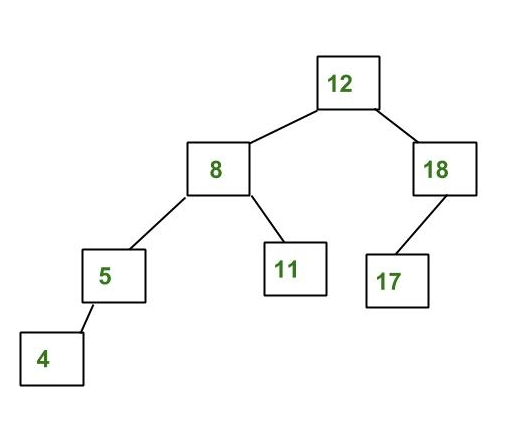

# AVL Tree

AVL tree is a self-balancing Binary Search Tree (BST) where the difference between heights of left and right subtrees cannot be more than one for all nodes.

**An Example Tree that is an AVL Tree**:



The above tree is AVL because differences between heights of left and right subtrees for every node is less than or equal to 1.

**An Example Tree that is NOT an AVL Tree**:


The above tree is not AVL because differences between heights of left and right subtrees for 8 and 12 is greater than 1.

**Why AVL Trees?**
Most of the BST operations (e.g., search, max, min, insert, delete.. etc) take O(h) time where h is the height of the BST. The cost of these operations may become O(n) for a skewed Binary tree. If we make sure that height of the tree remains O(Logn) after every insertion and deletion, then we can guarantee an upper bound of O(Logn) for all these operations. The height of an AVL tree is always O(Logn) where n is the number of nodes in the tree

## Insertion

To make sure that the given tree remains AVL after every insertion, we must augment the standard BST insert operation to perform some re-balancing.

Following are two basic operations that can be performed to re-balance a BST without violating the BST property (keys(left) < key(root) < keys(right)).
    1) Left Rotation
    2) Right Rotation

```Example
T1, T2 and T3 are subtrees of the tree 
rooted with y (on the left side) or x (on 
the right side)           
     y                               x
    / \     Right Rotation          /  \
   x   T3   - - - - - - - >        T1   y 
  / \       < - - - - - - -            / \
 T1  T2     Left Rotation            T2  T3
Keys in both of the above trees follow the 
following order 
 keys(T1) < key(x) < keys(T2) < key(y) < keys(T3)
So BST property is not violated anywhere.
```

**Steps to follow for insertion**:

Let the newly inserted node be w

**1)** Perform standard BST insert for w.
**2)** Starting from w, travel up and find the first unbalanced node. Let z be the first unbalanced node, y be the child of z that comes on the path from w to z and x be the grandchild of z that comes on the path from w to z.
**3)** Re-balance the tree by performing appropriate rotations on the subtree rooted with z. There can be 4 possible cases that needs to be handled as x, y and z can be arranged in 4 ways. Following are the possible 4 arrangements:
a) y is left child of z and x is left child of y (Left Left Case)
b) y is left child of z and x is right child of y (Left Right Case)
c) y is right child of z and x is right child of y (Right Right Case)
d) y is right child of z and x is left child of y (Right Left Case)

Following are the operations to be performed in above mentioned 4 cases. In all of the cases, we only need to re-balance the subtree rooted with z and the complete tree becomes balanced as the height of subtree (After appropriate rotations) rooted with z becomes same as it was before insertion.

**a) Left Left Case**:

```Example
T1, T2, T3 and T4 are subtrees.
         z                                      y 
        / \                                   /   \
       y   T4      Right Rotate (z)          x      z
      / \          - - - - - - - - ->      /  \    /  \ 
     x   T3                               T1  T2  T3  T4
    / \
  T1   T2
```

**b) Left Right Case**:

```Example
     z                               z                           x
    / \                            /   \                        /  \ 
   y   T4  Left Rotate (y)        x    T4  Right Rotate(z)    y      z
  / \      - - - - - - - - ->    /  \      - - - - - - - ->  / \    / \
T1   x                          y    T3                    T1  T2 T3  T4
    / \                        / \
  T2   T3                    T1   T2
```

**c) Right Right Case**:

```Example
  z                                y
 /  \                            /   \ 
T1   y     Left Rotate(z)       z      x
    /  \   - - - - - - - ->    / \    / \
   T2   x                     T1  T2 T3  T4
       / \
     T3  T4
```

**d) Right Left Case**:

```Example
   z                            z                            x
  / \                          / \                          /  \ 
T1   y   Right Rotate (y)    T1   x      Left Rotate(z)   z      y
    / \  - - - - - - - - ->     /  \   - - - - - - - ->  / \    / \
   x   T4                      T2   y                  T1  T2  T3  T4
  / \                              /  \
T2   T3                           T3   T4
```

**Implementation**: Following is the implementation for AVL Tree Insertion. The following implementation uses the recursive BST insert to insert a new node. In the recursive BST insert, after insertion, we get pointers to all ancestors one by one in a bottom-up manner. So we don’t need parent pointer to travel up. The recursive code itself travels up and visits all the ancestors of the newly inserted node.

1) Perform the normal BST insertion.
2) The current node must be one of the ancestors of the newly inserted node. Update the height of the current node.
3) Get the balance factor (left subtree height – right subtree height) of the current node.
4) If balance factor is greater than 1, then the current node is unbalanced and we are either in Left Left case or left Right case. To check whether it is left left case or not, compare the newly inserted key with the key in left subtree root.
5) If balance factor is less than -1, then the current node is unbalanced and we are either in Right Right case or Right-Left case. To check whether it is Right Right case or not, compare the newly inserted key with the key in right subtree root.

```c++
int height(node* root)
{
    if(root == NULL)
        return 0;
    return root->height;
}
int getBalance(node* root)
{
    if(root == NULL)
        return 0;
    return height(root->left) - height(root->right);
}

node* leftRotate(node* x)
{
    node* y = x->right;
    node* T2 = y->left;

    // Perform rotation
    y->left=x;
    x->right=T2;
    x->height = max(height(x->left),
                    height(x->right)) + 1;
    y->height = max(height(y->left),
                    height(y->right)) + 1;
    return y;
}

node* rightRotate(node* y)
{
    node* x = y->left;
    node* T2 = x->right;

    // Perform rotation
    x->right=y;
    y->left=T2;

    // y is child of x so update y before
    y->height = max(height(y->left),
                    height(y->right)) + 1;

    x->height = max(height(x->left),
                    height(x->right)) + 1;
    return x;
}

node* Insert(node* root,int data)
{
    if(root==NULL)
        return newNode(data);

    if(data == root->data)
        return root;
    if(data<root->data)
        root->left=Insert(root->left,data);
    if(data>root->data)
        root->right=Insert(root->right,data);

    root->height=1+max(height(root->left),height(root->right));

    int balance = getBalance(root);

    if(balance>1)
    {
        // Left Left Case
        if(data<root->left->data)
            return rightRotate(root);
        // Left Right Case
        if(data>root->left->data)
        {
            root->left=leftRotate(root->left);
            return rightRotate(root);
        }
    }
    if(balance<-1)
    {
        // Right Right Case
        if(data>root->right->data)
            return leftRotate(root);
        // Right Left Case
        if(data<root->right->data)
        {
            root->right=rightRotate(root->right);
            return leftRotate(root);
        }
    }
    return root;
}
```

**Time Complexity**: The rotation operations (left and right rotate) take constant time as only a few pointers are being changed there. Updating the height and getting the balance factor also takes constant time. So the time complexity of AVL insert remains same as BST insert which is O(h) where h is the height of the tree. Since AVL tree is balanced, the height is O(Logn). So time complexity of AVL insert is O(Logn).

## Deletion

**Steps to follow for deletion**.
To make sure that the given tree remains AVL after every deletion, we must augment the standard BST delete operation to perform some re-balancing. Following are two basic operations that can be performed to re-balance a BST without violating the BST property (keys(left) < key(root) < keys(right)).

1) Left Rotation
2) Right Rotation

```Example
T1, T2 and T3 are subtrees of the tree rooted with y (on left side)
or x (on right side)
                y                               x
               / \     Right Rotation          /  \
              x   T3   – - – - – - – >        T1   y
             / \       < - - - - - - -            / \
            T1  T2     Left Rotation            T2  T3
Keys in both of the above trees follow the following order
      keys(T1) < key(x) < keys(T2) < key(y) < keys(T3)
So BST property is not violated anywhere.
```

Unlike insertion, in deletion, after we perform a rotation at z, we may have to perform a rotation at ancestors of z. Thus, we must continue to trace the path until we reach the root.

**Implementation**: In the recursive BST delete, after deletion, we get pointers to all ancestors one by one in bottom up manner. So we don’t need parent pointer to travel up. The recursive code itself travels up and visits all the ancestors of the deleted node.

**1)** Perform the normal BST deletion.
**2)** The current node must be one of the ancestors of the deleted node. Update the height of the current node.
**3)** Get the balance factor (left subtree height – right subtree height) of the current node.
**4)** If balance factor is greater than 1, then the current node is unbalanced and we are either in Left Left case or Left Right case. To check whether it is Left Left case or Left Right case, get the balance factor of left subtree. If balance factor of the left subtree is greater than or equal to 0, then it is Left Left case, else Left Right case.
**5)** If balance factor is less than -1, then the current node is unbalanced and we are either in Right Right case or Right Left case. To check whether it is Right Right case or Right Left case, get the balance factor of right subtree. If the balance factor of the right subtree is smaller than or equal to 0, then it is Right Right case, else Right Left case.

```c++
node* minValueNode(node* root)
{
    node* curr = root;
    while(curr->left)
        curr=curr->left;
    return curr;
}

node* Delete(node* root,int data)
{
    if(root == NULL)
        return root;
    if(data > root->data)
        root->right=Delete(root->right,data);
    else
    {
        if(data < root->data)
            root->left=Delete(root->left,data);
        else
        {
            if(root->left == NULL || root->right == NULL)
            {
                node* temp = root->left != NULL
                            ? root->left
                            : root->right;
                if(temp == NULL)
                {
                    temp = root;
                    root = NULL;
                }else
                    *root = *temp;
                delete temp;
            }else
            {
                node* temp = minValueNode(root);
                root->data = temp->data;
                root->right=Delete(root->right,temp->data);
            }
        }
    }
    if(root == NULL)
        return root;
    root->height = 1 + max(height(root->left),
                           height(root->right));
    int balance = getBalance(root);
    if(balance > 1)
    {
        if(getBalance(root->left)>=0)
            return rightRotate(root);
        if(getBalance(root->left)<0)
        {
            root->left = leftRotate(root->left);
            return rightRotate(root);
        }
    }
    if(balance < -1)
    {
        if(getBalance(root->right)<=0)
            return leftRotate(root);
        if(getBalance(root->right)>0)
        {
            root->right=rightRotate(root->right);
            return leftRotate(root);
        }
    }
    return root;
}
```

**Time Complexity**: The rotation operations (left and right rotate) take constant time as only few pointers are being changed there. Updating the height and getting the balance factor also take constant time. So the time complexity of AVL delete remains same as BST delete which is O(h) where h is height of the tree. Since AVL tree is balanced, the height is O(Logn). So time complexity of AVL delete is O(Log n).
