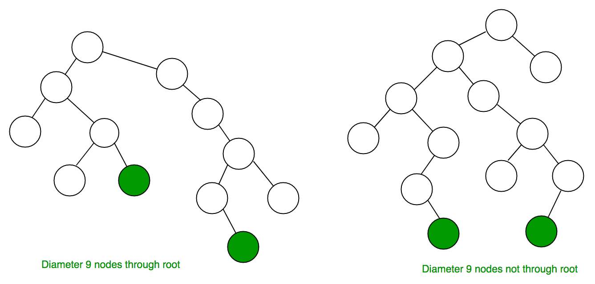
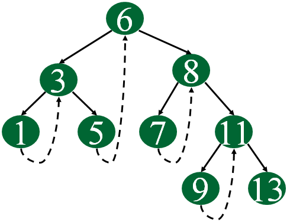

# Binary Tree

**Trees**: Unlike Arrays, Linked Lists, Stack and queues, which are linear data structures, trees are *hierarchical* data structures.

**Tree Vocabulary**: The topmost node is called root of the tree. The elements that are directly under an element are called its children. The element directly above something is called its parent.

```output
     tree
     ----
      j    <-- root
    /   \
   f      k  
 /   \      \
a     h      z    <-- leaves

'a’ is a child of ‘f’, and ‘f’ is the parent of ‘a’.
```

**Why Trees?**

**1**. One reason to use trees might be because you want to store information that naturally forms a hierarchy.

```output
file system
-----------
     /    <-- root
  /      \
...       home
      /          \
   ugrad        course
    /       /      |     \
  ...      cs101  cs112  cs113
```

**2**. Trees (with some ordering e.g., BST) provide moderate access/search (quicker than Linked List and slower than arrays).

**3**. Trees provide moderate insertion/deletion (quicker than Arrays and slower than Unordered Linked Lists).

**4**. Like Linked Lists and unlike Arrays, Trees don’t have an upper limit on number of nodes as nodes are linked using pointers.

**Main applications of trees** include:

**1**. Manipulate hierarchical data.
**2**. Make information easy to search.
**3**. Manipulate sorted lists of data.
**4**. As a workflow for compositing digital images for visual effects.
**5**. Router algorithms
**6**. Form of a multi-stage decision-making

**Binary Tree**: A tree whose elements have at most 2 children is called a binary tree. Since each element in a binary tree can have only 2 children, we typically name them the left and right child.

## Properties Binary Tree

_**1) The maximum number of nodes at level ‘l’ of a binary tree is 2^l^.**_

Here level is the number of nodes on the path from the root to the node (including root and node). Level of the root is 0.
This can be proved by induction.
For root, l = 0, number of nodes = 2^0^ = 1
Assume that the maximum number of nodes on level ‘l’ is 2^l^
Since in Binary tree every node has at most 2 children, next level would have twice nodes, i.e. 2 * 2^l^

_**2) The Maximum number of nodes in a binary tree of height ‘h’ is 2^h^ – 1.**_

Here the height of a tree is the maximum number of nodes on the root to leaf path. Height of a tree with a single node is considered as 1.
This result can be derived from point 2 above. A tree has maximum nodes if all levels have maximum nodes. So maximum number of nodes in a binary tree of height h is 1 + 2 + 4 + .. + 2^h^. This is a simple geometric series with h terms and sum of this series is 2^h^– 1.
In some books, the height of the root is considered as 0. In this convention, the above formula becomes 2^h+1^ – 1

_**3) In a Binary Tree with N nodes, minimum possible height or the minimum number of levels is? Log~2~(N+1) ?**_

This can be directly derived from point 2 above. If we consider the convention where the height of a root node is considered as 0, then above formula for minimum possible height becomes | Log~2~(N+1) | – 1

_**4) A Binary Tree with L leaves has at least | Log~2~L? |+ 1 levels**_

A Binary tree has the maximum number of leaves (and a minimum number of levels) when all levels are fully filled. Let all leaves be at level l, then below is true for the number of leaves L.

> L <=  2^l-1^  [From Point 1]
> l =   | Log~2~L | + 1
> where l is the minimum number of levels.

_**5) In Binary tree where every node has 0 or 2 children, the number of leaf nodes is always one more than nodes with two children.**_

> L = T + 1
> Where L = Number of leaf nodes
> T = Number of internal nodes with two children
> Proof:
> No. of leaf nodes (L) i.e. total elements present at the bottom of tree = 2^h-1^ (h is height of tree)
> No. of internal nodes = {total no. of nodes} - {leaf > nodes} = { 2^h^ - 1 } - { 2^h-1^ } = 2^h-1^ (2-1) - 1 = 2^h-1^ - 1
> So , L = 2^h-1^,T = 2^h-1^ - 1
> Therefore L = T + 1
> Hence proved

## Types of Binary Tree

**Full Binary Tree**: A Binary Tree is a full binary tree if every node has 0 or 2 children. The following are the examples of a full binary tree. We can also say a full binary tree is a binary tree in which all nodes except leaf nodes have two children.

```output
              18
           /       \  
         15         30  
        /  \        /  \
      40    50    100   40

             18
           /    \   
         15     20    
        /  \       
      40    50   
    /   \
   30   50

               18
            /     \  
          40       30  
                   /  \
                 100   40
```

**Complete Binary Tree**: A Binary Tree is a Complete Binary Tree if all the levels are completely filled except possibly the last level and the last level has all keys as left as possible

```output
              18
           /       \  
         15         30  
        /  \        /  \
      40    50    100   40


               18
           /       \  
         15         30  
        /  \        /  \
      40    50    100   40
     /  \   /
    8   7  9
```

In a Perfect Binary Tree, the number of leaf nodes is the number of internal nodes plus 1
L = I + 1 Where L = Number of leaf nodes, I = Number of internal nodes.

A Perfect Binary Tree of height h (where the height of the binary tree is the longest path from the root node to any leaf node in the tree, height of root node is 1) has 2h – 1 node.

An example of a Perfect binary tree is ancestors in the family. Keep a person at root, parents as children, parents of parents as their children.

**Balanced Binary Tree** A binary tree is balanced if the height of the tree is O(Log n) where n is the number of nodes. For Example, the AVL tree maintains O(Log n) height by making sure that the difference between the heights of the left and right subtrees is at most 1. Red-Black trees maintain O(Log n) height by making sure that the number of Black nodes on every root to leaf paths is the same and there are no adjacent red nodes. Balanced Binary Search trees are performance-wise good as they provide O(log n) time for search, insert and delete

**A degenerate (or pathological) tree** A Tree where every internal node has one child. Such trees are performance-wise same as linked list.

```output
      10
      /
    20
     \
     30
      \
      40 
```

## Tree Traversals (Inorder, Preorder and Postorder)


- Depth First Traversals:
  
  - Inorder (Left, Root, Right) : 4 2 5 1 3
  - Preorder (Root, Left, Right) : 1 2 4 5 3
  - Postorder (Left, Right, Root) : 4 5 2 3 1

- Breadth-First or Level Order Traversal: 1 2 3 4 5

**Inorder Traversal**:

```algorithm
Algorithm Inorder(tree)
   1. Traverse the left subtree, i.e., call Inorder(left-subtree)
   2. Visit the root.
   3. Traverse the right subtree, i.e., call Inorder(right-subtree)
```

```c++
void printInorder(struct Node* node)
{
    if (node == NULL)
        return;
 
    /* first recur on left child */
    printInorder(node->left);
 
    /* then print the data of node */
    cout << node->data << " ";
 
    /* now recur on right child */
    printInorder(node->right);
}
```

**Preorder Traversal**:

```algorithm
Algorithm Preorder(tree)
   1. Visit the root.
   2. Traverse the left subtree, i.e., call Preorder(left-subtree)
   3. Traverse the right subtree, i.e., call Preorder(right-subtree)
```

```c++
void printPreorder(struct Node* node)
{
    if (node == NULL)
        return;
 
    /* first print data of node */
    cout << node->data << " ";
 
    /* then recur on left subtree */
    printPreorder(node->left);
 
    /* now recur on right subtree */
    printPreorder(node->right);
}
```

**Postorder Traversal (Practice)**:

```algorithm
Algorithm Postorder(tree)
   1. Traverse the left subtree, i.e., call Postorder(left-subtree)
   2. Traverse the right subtree, i.e., call Postorder(right-subtree)
   3. Visit the root.
```

```c++
void printPostorder(struct Node* node)
{
    if (node == NULL)
        return;
 
    // first recur on left subtree
    printPostorder(node->left);
 
    // then recur on right subtree
    printPostorder(node->right);
 
    // now deal with the node
    cout << node->data << " ";
}
```

**Breadth-First or Level Order Traversal**:

**Method 1 (Use function to print a current level)**:

**Algorithm**:
There are basically two functions in this method. One is to print all nodes at a given level (printCurrentLevel), and other is to print level order traversal of the tree (printLevelorder). printLevelorder makes use of printCurrentLevel to print nodes at all levels one by one starting from the root.

```algorithm
/*Function to print level order traversal of tree*/

printLevelorder(tree)
for d = 1 to height(tree)
   printCurrentLevel(tree, d);

/*Function to print all nodes at a current level*/

printCurrentLevel(tree, level)
if tree is NULL then return;
if level is 1, then
    print(tree->data);
else if level greater than 1, then
    printCurrentLevel(tree->left, level-1);
    printCurrentLevel(tree->right, level-1);
```

```c++
void printLevelOrder(node* root)
{
    int h = height(root);
    int i;
    for (i = 1; i <= h; i++)
        printCurrentLevel(root, i);
}
 
/* Print nodes at a current level */
void printCurrentLevel(node* root, int level)
{
    if (root == NULL)
        return;
    if (level == 1)
        cout << root->data << " ";
    else if (level > 1) {
        printCurrentLevel(root->left, level - 1);
        printCurrentLevel(root->right, level - 1);
    }
}
 
/* Compute the "height" of a tree -- the number of
    nodes along the longest path from the root node
    down to the farthest leaf node.*/
int height(node* node)
{
    if (node == NULL)
        return 0;
    else {
        /* compute the height of each subtree */
        int lheight = height(node->left);
        int rheight = height(node->right);
 
        /* use the larger one */
        if (lheight > rheight) {
            return (lheight + 1);
        }
        else {
            return (rheight + 1);
        }
    }
}
```

**Time Complexity**: O(n^2^) in worst case
**Space Complexity**: O(n) in worst case.

**Method 2 (Using queue)**:

**Algorithm**:
For each node, first the node is visited and then it’s child nodes are put in a FIFO queue.

```algorithm
printLevelorder(tree)
1) Create an empty queue q
2) temp_node = root /*start from root*/
3) Loop while temp_node is not NULL
    a) print temp_node->data.
    b) Enqueue temp_node’s children 
      (first left then right children) to q
    c) Dequeue a node from q.
```

```c++
// Iterative method to find height of Binary Tree
void printLevelOrder(Node* root)
{
    // Base Case
    if (root == NULL)
        return;
 
    // Create an empty queue for level order traversal
    queue<Node*> q;
 
    // Enqueue Root and initialize height
    q.push(root);
 
    while (q.empty() == false) {
        // Print front of queue and remove it from queue
        Node* node = q.front();
        cout << node->data << " ";
        q.pop();
 
        /* Enqueue left child */
        if (node->left != NULL)
            q.push(node->left);
 
        /*Enqueue right child */
        if (node->right != NULL)
            q.push(node->right);
    }
}
```

**Time Complexity**: O(n) where n is the number of nodes in the binary tree
**Space Complexity**: O(n) where n is the number of nodes in the binary tree

## BFS vs DFS for Binary Tree

**Why do we care?**
There are many tree questions that can be solved using any of the above four traversals.

**Is there any difference in terms of Time Complexity?**
All four traversals require O(n) time as they visit every node exactly once.

**Is there any difference in terms of Extra Space?**
There is difference in terms of extra space required.

- Extra Space required for Level Order Traversal is O(w) where w is maximum width of Binary Tree. In level order traversal, queue one by one stores nodes of different level.
- Extra Space required for Depth First Traversals is O(h) where h is maximum height of Binary Tree. In Depth First Traversals, stack (or function call stack) stores all ancestors of a node.

## Diameter of a Binary Tree

The diameter of a tree (sometimes called the width) is the number of nodes on the longest path between two end nodes



The diameter of a tree T is the largest of the following quantities:

- the diameter of T’s left subtree.
- the diameter of T’s right subtree.
- the longest path between leaves that goes through the root of T (this can be computed from the heights of the subtrees of T)

```c++
// Function to get diameter of a binary tree
int diameter(struct node* tree)
{
    // base case where tree is empty
    if (tree == NULL)
        return 0;
 
    // get the height of left and right sub-trees
    int lheight = height(tree->left);
    int rheight = height(tree->right);
 
    // get the diameter of left and right sub-trees
    int ldiameter = diameter(tree->left);
    int rdiameter = diameter(tree->right);
 
    // Return max of following three
    // 1) Diameter of left subtree
    // 2) Diameter of right subtree
    // 3) Height of left subtree + height of right subtree + 1
    return max(lheight + rheight + 1,
            max(ldiameter, rdiameter));
}
 
// UTILITY FUNCTIONS TO TEST diameter() FUNCTION
 
// The function Compute the "height" of a tree. Height is
// the number f nodes along the longest path from the root
// node down to the farthest leaf node.
int height(struct node* node)
{
    // base case tree is empty
    if (node == NULL)
        return 0;
 
    // If tree is not empty then height = 1 + max of left
    // height and right heights
    return 1 + max(height(node->left), height(node->right));
}
```

**Time Complexity**: O(n^2^)

**Optimized implementation**: The above implementation can be optimized by calculating the height in the same recursion rather than calling a height() separately

```c++
int Diameter(node* root,int* height)
{
    if(root == NULL)
    {
        *height=0;
        return 0;
    }
    // lh --> Height of left subtree
    // rh --> Height of right subtree
    int lh=0;
    int rh=0;

    // ldiameter  --> diameter of left subtree
    // rdiameter  --> Diameter of right subtree
    int ldiameter = 0, rdiameter = 0;

    ldiameter = Diameter(root->left,&lh);
    rdiameter = Diameter(root->right,&rh);

    *height = max(lh,rh)+1;
    return max({lh+rh+1,ldiameter,rdiameter});
}
```

**Time Complexity**: O(n)

## Inorder Tree Traversal without Recursion

Using Stack is the obvious way to traverse tree without recursion.

```algorithm
1) Create an empty stack S.
2) Initialize current node as root
3) Push the current node to S and set current = current->left until current is NULL
4) If current is NULL and stack is not empty then 
     a) Pop the top item from stack.
     b) Print the popped item, set current = popped_item->right 
     c) Go to step 3.
5) If current is NULL and stack is empty then we are done.
```

```c++
void PrintInOrderStack(node* root)
{
    stack<node*> st;
    for(node* temp = root;st.size() || temp != NULL;st.pop())
    {
        while(temp!=NULL)
        {
            st.push(temp);
            temp=temp->left;
        }
        temp=st.top();
        cout << temp->data << ' ';
        temp=temp->right;
    }
}
```

**Time Complexity**: O(n)

## Inorder Tree Traversal without recursion and without stack

Using Morris Traversal, we can traverse the tree without using stack and recursion. The idea of Morris Traversal is based on Threaded Binary Tree. In this traversal, we first create links to Inorder successor and print the data using these links, and finally revert the changes to restore original tree

```algorithm
1. Initialize current as root 
2. While current is not NULL
   If the current does not have left child
      a) Print current’s data
      b) Go to the right, i.e., current = current->right
   Else
        Find rightmost node in current left subtree OR
            node whose right child == current.
        If we found right child == current
            a) Update the right child as NULL of that node whose right child is current
            b) Print current’s data
            c) Go to the right, i.e. current = current->right
        Else
            a) Make current as the right child of that rightmost 
                node we found; and 
            b) Go to this left child, i.e., current = current->left
```

```c++
void MorrisTraversal(node* root)
{
    if(root == NULL)
        return;
    node* curr = root;
    for(node* pre;curr!=NULL;)
    {
        if(curr->left == NULL)
        {
            cout << curr->data << ' ';
            curr = curr->right;
        }else
        {
            pre = curr->left;
            while(pre->right != NULL && pre->right != curr)
                pre = pre->right;
            if(pre->right == NULL)
            {
                pre->right = curr;
                curr=curr->left;
            }else
            {
                pre->right = NULL;
                cout << curr->data << ' ';
                curr=curr->right;
            }
        }
    }
}
```

**Time Complexity** : O(n)

## Threaded Binary Tree

The idea of threaded binary trees is to make inorder traversal faster and do it without stack and without recursion. A binary tree is made threaded by making all right child pointers that would normally be NULL point to the inorder successor of the node (if it exists)

There are two types of threaded binary trees.

- **Single Threaded**: Where a NULL right pointers is made to point to the inorder successor (if successor exists)
- **Double Threaded**: Where both left and right NULL pointers are made to point to inorder predecessor and inorder successor respectively. The predecessor threads are useful for reverse inorder traversal and postorder traversal.

The threads are also useful for fast accessing ancestors of a node.

Following diagram shows an example Single Threaded Binary Tree. The dotted lines represent threads.



```c
// Utility function to find leftmost node in a tree rooted
// with n
struct Node* leftMost(struct Node* n)
{
    if (n == NULL)
        return NULL;
 
    while (n->left != NULL)
        n = n->left;
 
    return n;
}
 
// C code to do inorder traversal in a threaded binary tree
void inOrder(struct Node* root)
{
    struct Node* cur = leftMost(root);
    while (cur != NULL) {
        printf("%d ", cur->data);
 
        // If this node is a thread node, then go to
        // inorder successor
        if (cur->rightThread)
            cur = cur->right;
        else // Else go to the leftmost child in right
             // subtree
            cur = leftmost(cur->right);
    }
}
```

## Write a Program to Find the Maximum Depth or Height of a Tree

Given a binary tree, find height of it. Height of empty tree is -1, height of tree with one node is 0 and height of below tree is 2.

```algorithm
 maxDepth()
1. If tree is empty then return -1
2. Else
     (a) Get the max depth of left subtree recursively  i.e., 
          call maxDepth( tree->left-subtree)
     (a) Get the max depth of right subtree recursively  i.e., 
          call maxDepth( tree->right-subtree)
     (c) Get the max of max depths of left and right 
          subtrees and add 1 to it for the current node.
         max_depth = max(max dept of left subtree,  
                             max depth of right subtree) 
                             + 1
     (d) Return max_depth
```

```c++
int maxDepth(node* root)
{
    if(root == NULL)
        return -1;
    int lDepth = maxDepth(root->left);
    int rDepth = maxDepth(root->right);
    return max(lDepth,rDepth)+1;
}
```

**Time Complexity**: O(n)

**Method 2**: Another method to solve this problem is to do **Level Order Traversal**. While doing the level order traversal, while adding Nodes at each level to Queue, we have to add **NULL Node** so that whenever it is encountered, we can increment the value of variable and that level get counted.

```c++
int maxDepth2(node* root)
{
    queue<node*> qu;
    qu.push(root);
    qu.push(NULL);
    int result=0;
    for(node* curr;qu.size();)
    {
        curr = qu.front();
        qu.pop();
        if(curr == NULL)
            result++;
        if(curr!=NULL)
        {
            if(curr->left)
                qu.push(curr->left);
            if(curr->right)
                qu.push(curr->right);
        }else
        {
            if(qu.size())
                qu.push(NULL);
        }
    }
    return result;
}
```

**Time Complexity**: O(n)
**Space Complexity**: O(n)

## If you are given two traversal sequences, can you construct the binary tree?

It depends on what traversals are given. If one of the traversal methods is Inorder then the tree can be constructed, otherwise not.

**Therefore, following combination can uniquely identify a tree**.

Inorder and Preorder.
Inorder and Postorder.
Inorder and Level-order.

**And following do not**.
Postorder and Preorder.
Preorder and Level-order.
Postorder and Level-order.

For example, Preorder, Level-order and Postorder traversals are same for the trees given in above diagram.

Preorder Traversal = AB
Postorder Traversal = BA
Level-Order Traversal = AB

So, even if three of them (Pre, Post and Level) are given, the tree can not be constructed.

## Print nodes at k distance from root

Given a root of a tree, and an integer k. Print all the nodes which are at k distance from root.

```Example
For example, in the below tree, 4, 5 & 8 are at distance 2 from root. 
            1
          /   \
        2      3
      /  \    /
    4     5  8 
```

```c++
void PrintKDistant(node* root,int level)
{
    if(level<0 || root == NULL)
        return;
    if(level == 0)
    {
        cout << root->data << ' ';
        return;
    }
    PrintKDistant(root->left,level-1);
    PrintKDistant(root->right,level-1);
}
```

**Time Complexity**: O(n) where n is number of nodes in the given binary tree.
**Space Complexity** : O(height of the binary tree).

## Print Ancestors of a given node in Binary Tree

Given a Binary Tree and a key, write a function that prints all the ancestors of the key in the given binary tree.

```Example
For example, if the given tree is following Binary Tree and key is 7, 
then your function should print 4, 2 and 1. 
              1
            /   \
          2      3
        /  \
      4     5
     /
    7
```

```c++
bool PrintAncestors(node* root,int target)
{
    if(root == NULL)
        return false;
    if(root->data == target)
        return true;
    if(PrintAncestors(root->left,target)||
       PrintAncestors(root->right,target))
    {
        cout << root->data << ' ';
        return true;
    }
    return false;
}
```

**Time Complexity**: O(n) where n is the number of nodes in the given Binary Tree.

## Check if a binary tree is subtree of another binary tree

Given two binary trees, check if the first tree is subtree of the second one. A subtree of a tree T is a tree S consisting of a node in T and all of its descendants in T. The subtree corresponding to the root node is the entire tree; the subtree corresponding to any other node is called a proper subtree.

```Example
For example, in the following case, tree S is a subtree of tree T. 

        Tree 2
          10  
        /    \ 
      4       6
       \
        30
 

        Tree 1
              26
            /   \
          10     3
        /    \     \
      4       6      3
       \
        30
```

**Solution**: Traverse the tree T in preorder fashion. For every visited node in the traversal, see if the subtree rooted with this node is identical to S.

```c++
bool areIdentical(node* rootT,node* rootS)
{
    if(rootT == NULL && rootS == NULL)
        return true;
    if(rootT == NULL || rootS == NULL)
        return true;
    return (rootS->data == rootT->data &&
            areIdentical(rootT->left,rootS->left) &&
            areIdentical(rootS->right,rootT->right));
}

bool isSubTree(node* rootT,node* rootS)
{
    if(rootS == NULL || rootT == NULL)
        return true;
    if(areIdentical(rootT,rootS))
        return true;
    return isSubTree(rootT->left,rootS) || 
            isSubTree(rootT->right,rootS);
}
```

**Time Complexity**: Time worst-case complexity of above solution is O(mn) where m and n are number of nodes in given two trees.
**Auxiliary space**: O(n)

## Maximum width of a binary tree

Given a binary tree, write a function to get the maximum width of the given tree. Width of a tree is maximum of widths of all levels.

```Example
Let us consider the below example tree.  

         1
        /  \
       2    3
     /  \     \
    4    5     8 
              /  \
             6    7
For the above tree, 
width of level 1 is 1, 
width of level 2 is 2, 
width of level 3 is 3 
width of level 4 is 2. 
So the maximum width of the tree is 3.
```

**Method 1 (Using Level Order Traversal with Queue)**
We store all the child nodes at the current level in the queue and then count the total number of nodes after the level order traversal for a particular level is completed. Since the queue now contains all the nodes of the next level, we can easily find out the total number of nodes in the next level by finding the size of queue. We then follow the same procedure for the successive levels. We store and update the maximum number of nodes found at each level.

```c++
int maxWidth(node* root)
{
    if(root == NULL)
        return 0;
    int result=0;
    queue<node*> qu;
    qu.push(root);
    for(node* temp;qu.size();)
    {
        result=max(result,(int)qu.size());
        for(int _n=qu.size();_n;--_n)
        {
            temp = qu.front();
            qu.pop();
            if(temp->left != NULL)
                qu.push(temp->left);
            if(temp->right != NULL)
                qu.push(temp->right);
        }
    }
    return result;
}
```

**Time Complexity**: O(N) where N is the total number of nodes in the tree.
**Auxiliary Space**: O(w) where w is the maximum width of the tree.

**Method 2 (Using Preorder Traversal)**
In this method, we create a temporary array count[] of size equal to the height of tree. We initialize all values in count as 0. We traverse the tree using preorder traversal and fill the entries in count so that the count array contains count of nodes at each level in Binary Tree.

```c++
void getMaxWidthRecur(node* root,int arr[],int level)
{
    if(root == NULL)
        return;
    ++arr[level];
    getMaxWidthRecur(root->left,arr,level+1);
    getMaxWidthRecur(root->right,arr,level+1);
}

int getMaxWidth2(node* root)
{
    if(root == NULL)
        return 0;
    int h = maxDepth(root);
    int Count[h];
    for(int i=0;i<h;++i)
        Count[i]=0;
    int level=0;
    getMaxWidthRecur(root,Count,level);
    int result=Count[0];
    for(int i=0;i<h;++i)
        result=max(result,Count[i]);
    return result;
}
```

**Time Complexity**: O(n)
